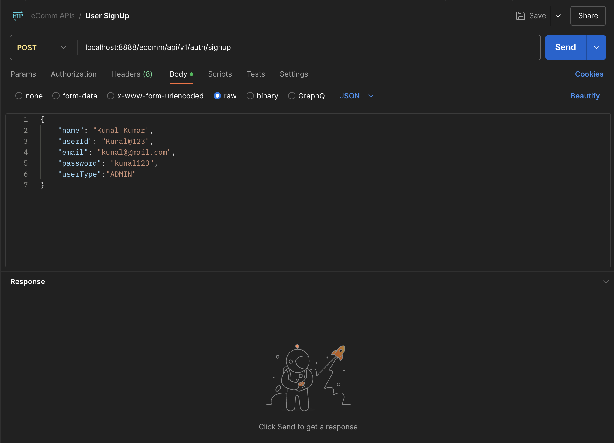
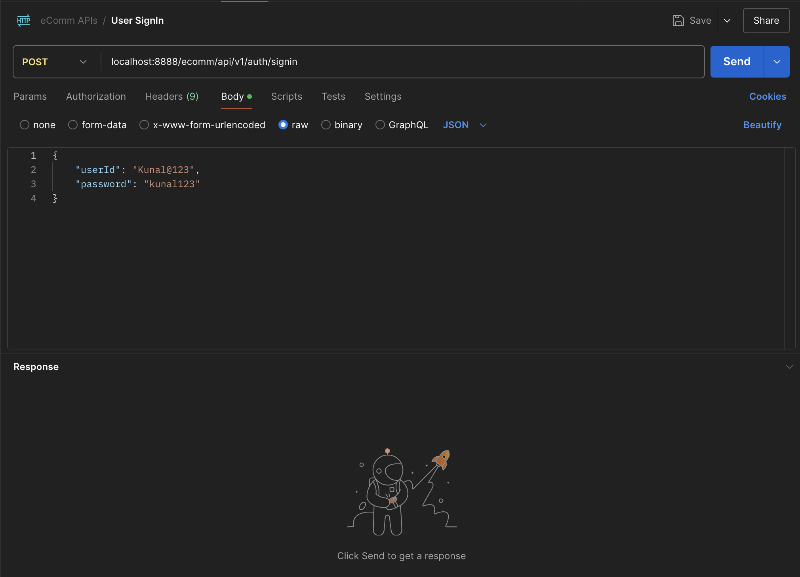
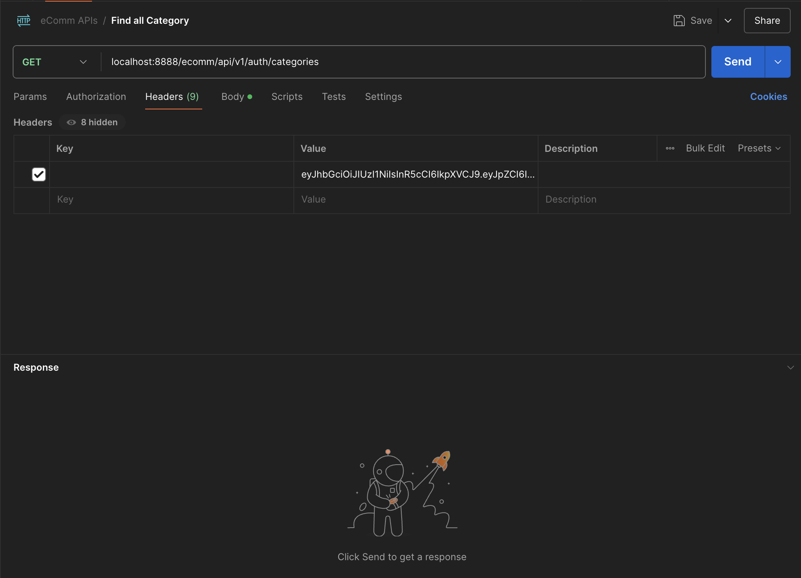
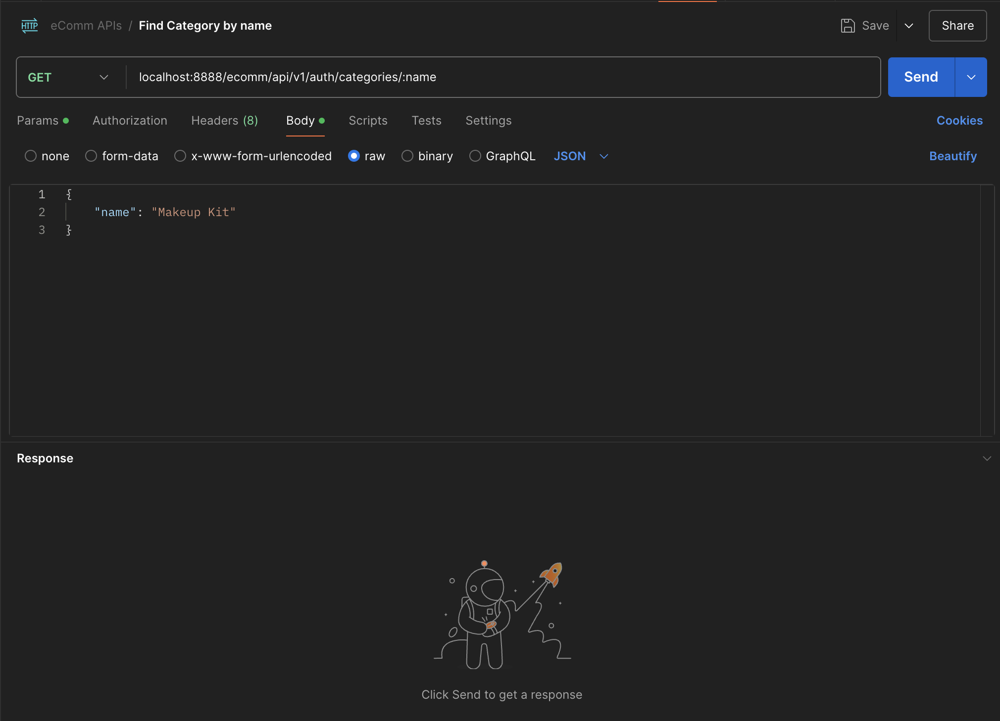
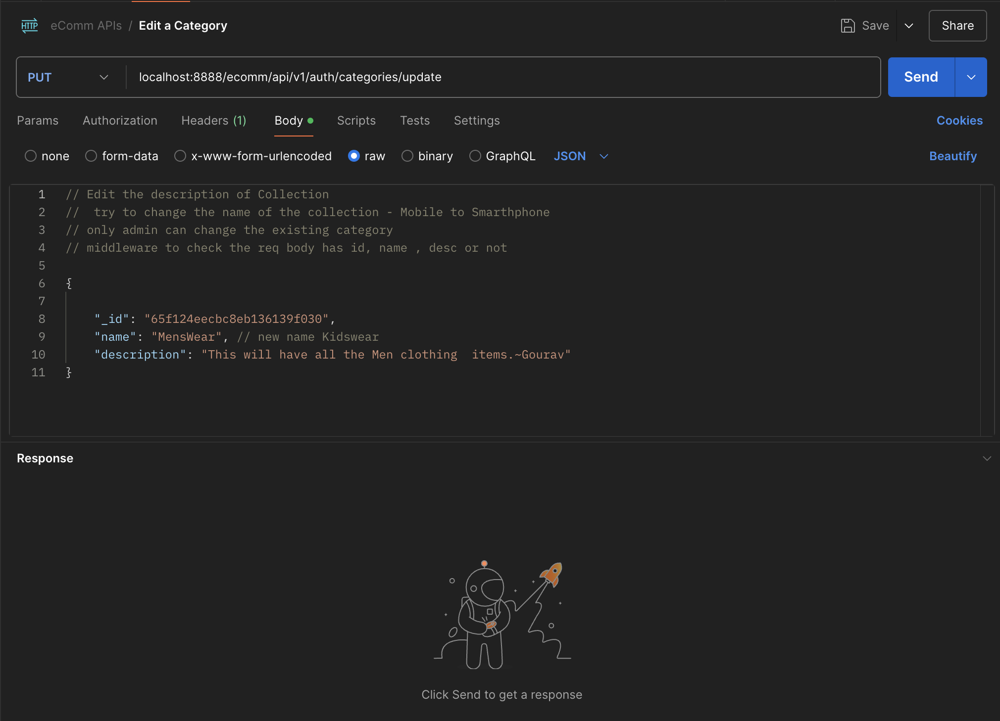
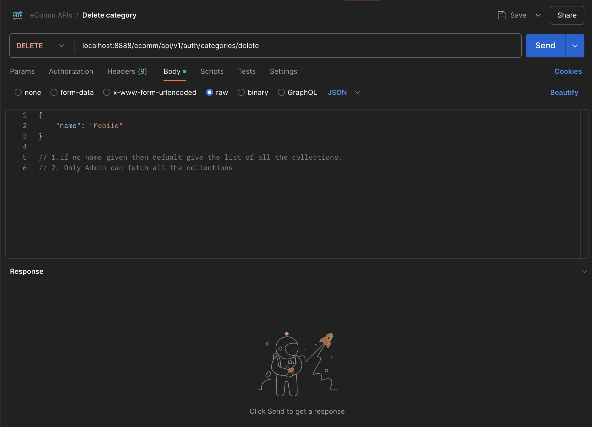

# E-Commerce Backend
This project is an e-commerce backend application built using Node.js and Express.js. It follows a 3-tier architecture:

**Router:** Handles incoming user requests.
**Controller:** Processes user data and manages business logic.
**Model:** Interfaces with the database for data storage and retrieval.

## Tech Stack
* **Node.js:** JavaScript runtime environment for executing server-side code.
* **Express.js:** A minimal and flexible Node.js web application framework for routing and middleware.
* **MongoDB:** NoSQL database for storing user, product, and order information.
* **Mongoose:** MongoDB object modeling tool for schema definition and data validation.
* **JWT (JSON Web Token):** For secure, token-based authentication and session management.
* **bcrypt:** For password encryption to securely store sensitive user data.
* **Postman:** Used for testing API endpoints during development.

 ## Features
* RESTful APIs to handle user authentication, product management, and order processing.
* Token-based authentication using JWT (JSON Web Token).
* Password encryption using bcrypt for securely storing user credentials.
* Schema-driven data management with models that define the structure of data stored in the database.
* Middleware for validating user requests and authenticating tokens.

## Project Structure
📂 ECOMMERCEPROJECT/  ┣ 📂 models/  ┃ ┣ 📜 userModel.js  ┃ ┣ 📜 productModel.js  ┃ ┗ 📜 CategoryModel.js  ┣ 📂 controllers/  ┃ ┣ 📜 userController.js  ┃ ┣ 📜 productController.js   ┃ ┗ 📜 CategoryController.js  ┣ 📂 routes/  ┃ ┣ 📜 userRoutes.js  ┃ ┣ 📜 productRoutes.js  ┃ ┗ 📜 CategoryRoutes.js  ┣ 📂 middlewares/  ┃ ┣ 📜 authMiddleware.js   ┃ ┣ 📜 Category.ReqValidator   ┣ 📂 config/   ┃ ┣ auth.config.js 📜   ┃ ┣ 📜 dbconfig.js  ┃ ┣ 📜 server.config.js   ┃ ┗ 📜 server.js

## Technologies Used
- **Node.js**: JavaScript runtime for building scalable server-side applications.
- **Express.js**: Web framework for handling routes and middleware.
- **JWT**: Used for secure, token-based authentication.
- **bcrypt**: Used to hash and encrypt sensitive user data like passwords.
- **MongoDB**: Database for storing user, product, and order data.

## Installation and Setup

1. Clone the repository:
--> git clone https://github.com/Gourav-kumar2131/e-Commerce-Backend.git  
--> cd e-Commerce-Backend  

2. Install dependencies:  
  -->  npm install

3. Configure environment variables: Create a .config file with the following:
--> PORT=3000  
--> MONGO_URI= your_mongo_database_uri  
--> DB name = youd_Mongo_database_name  
--> JWT_SECRET= your_jwt_secretCode  

## API Endpoints
**Authentication**
* **POST** localhost:8888/ecomm/api/v1/auth/signup - Register a new user.  

* **POST** /api/auth/login - Log in a user and return a JWT token.  

**Category Management**
* **GET** localhost:8888/ecomm/api/v1/auth/categories - Fetch all the Category  

* **GET** localhost:8888/ecomm/api/v1/auth/categories/:name  - Fetch specific catergory by name  

* **PUT** localhost:8888/ecomm/api/v1/auth/categories/update - Edit a Category  

* **DELETE** localhost:8888/ecomm/api/v1/auth/categories/delete - Delete a Category by name  

## Product Management
* **GET** /api/products - Fetch all products. 
* **POST** /api/products - Create a new product (admin only).
* **POST** /api/orders - Place a new order.
* **GET** /api/orders/:id - Get details of a specific order.

## Security Features
* **Token-based authentication:** JWT ensures secure login and user sessions.
* **Password hashing:** bcrypt hashes and encrypts passwords before storing them in the database.
* **Request validation:** Middleware checks and validates incoming requests for secure and consistent data handling.
## Future Improvements
1. Add support for payment gateway integration.
2. Implement role-based access control for admin and user functionalities.

